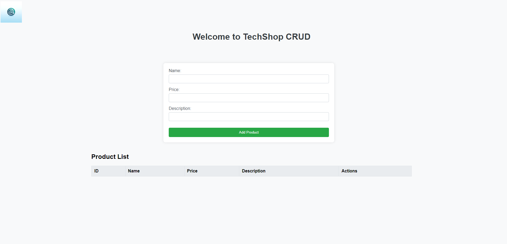
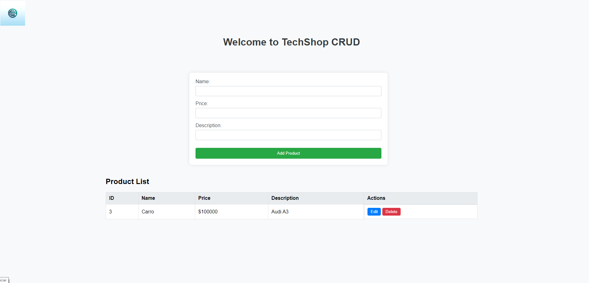
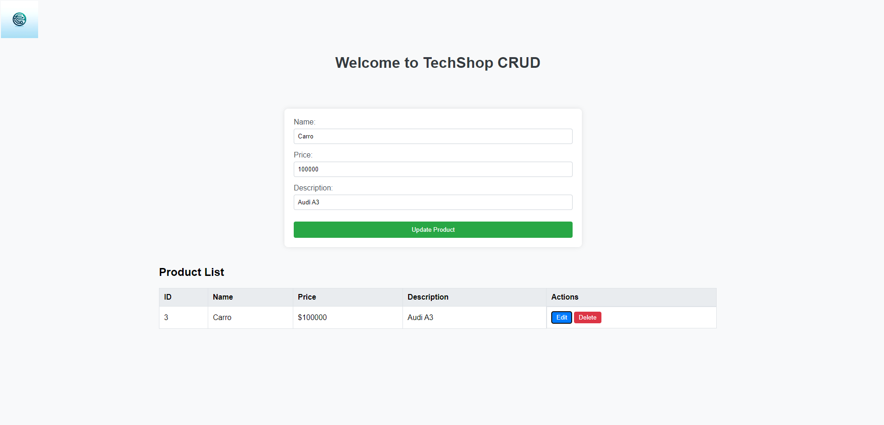
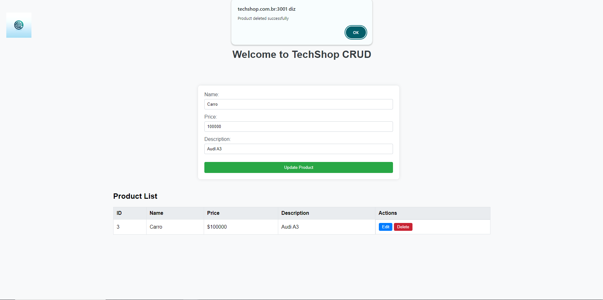

# Aplicação TechShop CRUD

Bem-vindo ao repositório da aplicação TechShop CRUD. Esta aplicação permite gerenciar produtos através de uma interface CRUD (Create, Read, Update, Delete). A aplicação é construída utilizando React e estilizada para uma experiência de usuário moderna e responsiva.

## Índice

- [Visão Geral](#visão-geral)
- [Funcionalidades](#funcionalidades)
- [Capturas de Tela](#capturas-de-tela)
- [Começando](#começando)
- [Pré-requisitos](#pré-requisitos)
- [Instalação](#instalação)
- [Executando a Aplicação](#executando-a-aplicação)
- [Uso](#uso)
- [Explicação em Vídeo](#explicação-em-vídeo)
- [Contribuindo](#contribuindo)
- [Atualização de Hosts no Windows](#atualização-de-hosts-no-windows)

## Visão Geral

A aplicação TechShop CRUD é projetada para gerenciar uma lista de produtos com funcionalidades para adicionar, atualizar, deletar e listar produtos. O front-end é construído com React e estilizado para um visual limpo e moderno.

## Funcionalidades

- Adicionar novos produtos
- Atualizar produtos existentes
- Deletar produtos
- Visualizar a lista de todos os produtos
- Design responsivo para mobile e desktop

## Capturas de Tela

### Página Inicial


### Lista de Produtos


### Editar Produto


### Produto Deletado


## Começando

Siga estas instruções para configurar e executar o projeto em sua máquina local.

### Pré-requisitos

- Docker
- Docker Compose

### Instalação

1. Clone o repositório:

```bash
git clone https://github.com/RafaelSedor/techshop.git
cd techshop
```

## Atualização de Hosts no Windows

Para redirecionar `localhost` para `techshop.com.br` no Windows, edite o arquivo hosts:

1. Abra o Notepad como Administrador.
2. Abra o arquivo `C:\Windows\System32\drivers\etc\hosts`.
3. Adicione a linha:

```plaintext
127.0.0.1 techshop.com.br
```

### Executando a Aplicação

1. Remova quaisquer contêineres, imagens, volumes e redes antigos:

```bash
docker-compose down --rmi all --volumes --remove-orphans
```

2. Construa e inicie a aplicação:

```bash
docker-compose up -d --build
```

3. A aplicação estará disponível em `http://techshop.com.br/:3001`.

## Uso

1. **Adicionar Produto**: Preencha os detalhes do produto no formulário e clique em "Add Product".
2. **Editar Produto**: Clique no botão "Edit" ao lado do produto que deseja editar, atualize os detalhes e clique em "Update Product".
3. **Deletar Produto**: Clique no botão "Delete" ao lado do produto que deseja deletar.

## Explicação em Vídeo

Para uma explicação detalhada da aplicação, por favor, assista ao vídeo tutorial:

[](https://youtu.be/SJee1qrHcU4)

## Contribuindo

Contribuições são bem-vindas! Por favor, abra uma issue ou envie um pull request para quaisquer alterações ou melhorias.

---
Seguindo as instruções acima, você deve ser capaz de configurar e executar a aplicação TechShop CRUD localmente. Se encontrar algum problema ou tiver sugestões de melhorias, sinta-se à vontade para contribuir ou abrir uma issue no GitHub.
